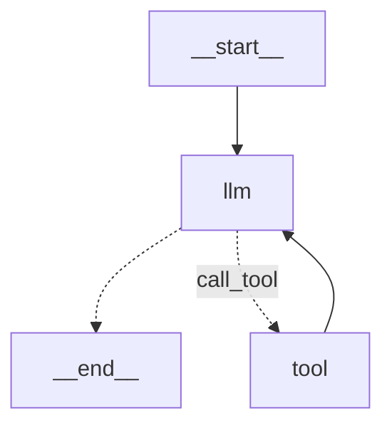

# AI Agents — LKStore

Autonomous AI agent system for processing e-commerce **return & exchange requests**, built with **LangGraph** using the **ReAct (Reason + Act)** pattern.

## Tech Stack

- Python 3.10+
- [LangGraph](https://github.com/langchain-ai/langgraph)
- `uv` (package manager)

## Setup

### 1. Clone the repo

```bash
git clone https://github.com/bqtankiet/kltn-agentic-ai.git
cd agents
```

### 2. Create virtual environment

```bash
pip install uv
uv venv .venv
.venv\Scripts\activate   # Windows
# source .venv/bin/activate  # macOS/Linux
uv sync
```

### 3. Start the LangGraph server

```bash
langgraph dev
# → http://localhost:2024
```

## Development

```bash
make format         # Format code
make lint_package   # Lint
make test           # Run tests
```

## How It Works

The agent follows the **ReAct pattern** — iterating between reasoning (LLM) and acting (tool calls) until it reaches a final decision.



- `llm` — Reasoning node: interprets the request and decides next action
- `tool` — Acting node: executes tools (e.g., fetch order info, validate policy)
- Dashed arrows indicate conditional edges (LLM decides to stop or call a tool)
