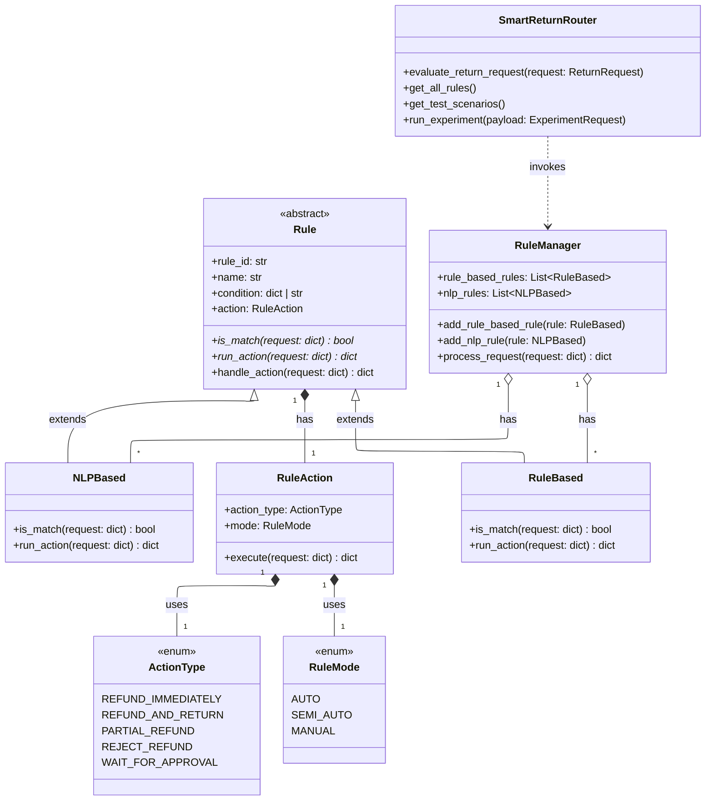
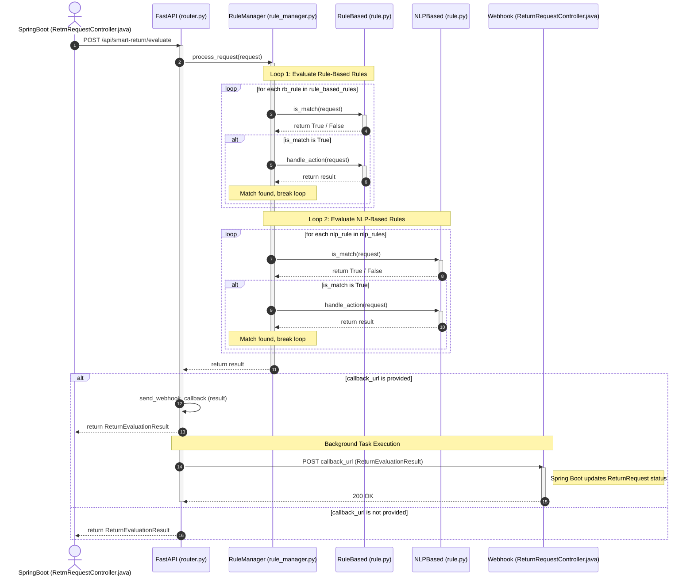
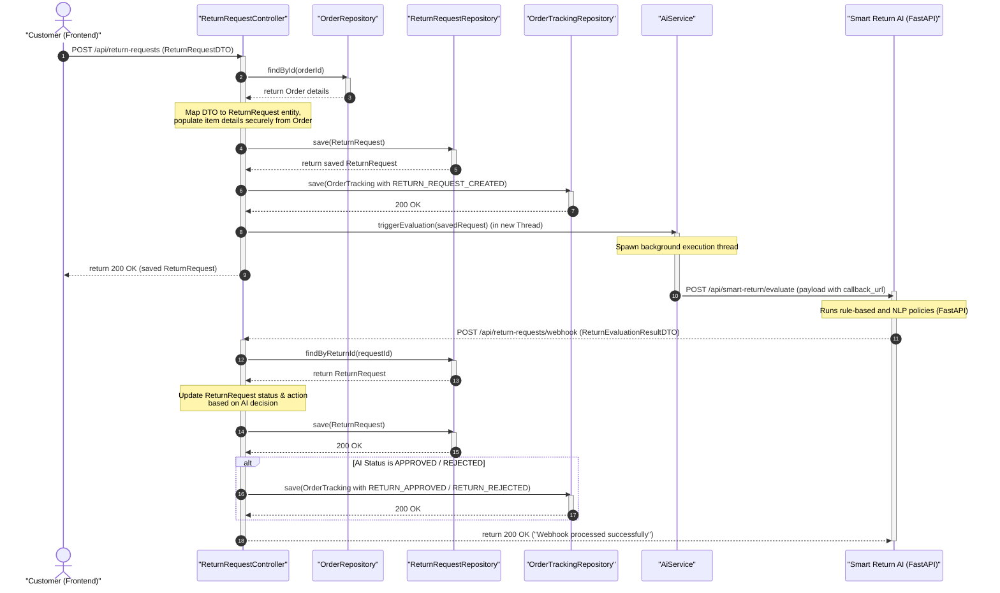
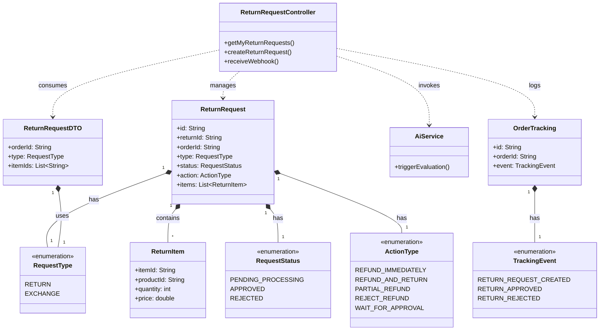
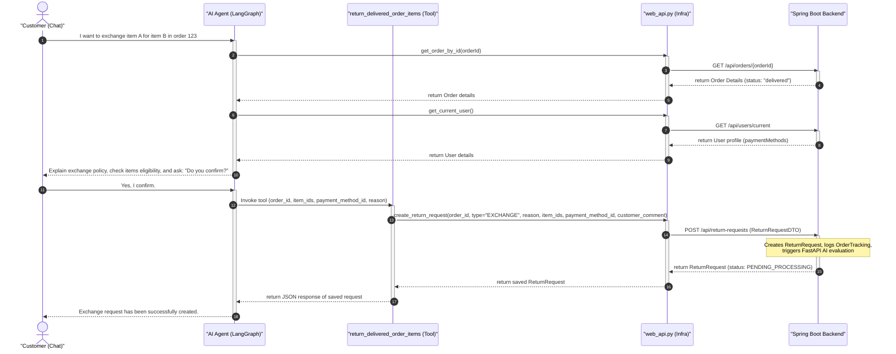
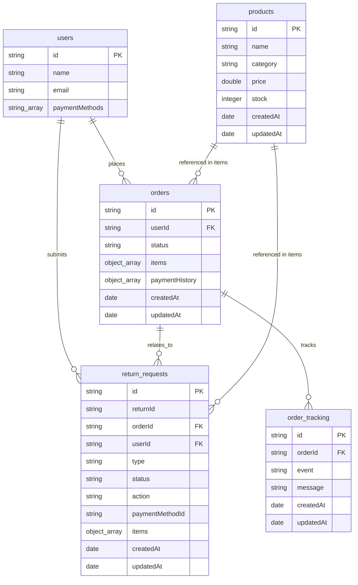
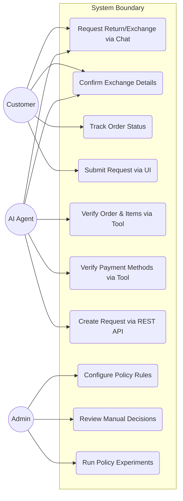

# Smart Return Rule Engine Class Diagram

This document contains the class diagram representing the architecture of the Smart Return Rule Engine, including rules, the rule manager, and the system enums.

## Smart Return Processing Sequence Diagram

This sequence diagram illustrates the flow of the core rule-evaluation logic, including the asynchronous webhook callback to the Spring Boot portal.

## Spring Boot Return Request Handling Sequence Diagram

This sequence diagram illustrates the complete workflow of a return request inside the Spring Boot portal backend, from customer submission to database persistence, asynchronous AI evaluation trigger, and webhook callback result processing.

## Spring Boot Return and Exchange Class Diagram

This class diagram represents the entity model, DTOs, controllers, services, and enum definitions within the Spring Boot portal backend that support the return and exchange processing system.

## AI Agent Exchange Processing Sequence Diagram

This sequence diagram illustrates how the AI Agent interacts with the Customer and uses system tools to perform validation and create an exchange request in the Spring Boot backend.

## MongoDB Database Diagram

This Entity Relationship Diagram (ERD) represents the MongoDB collection schemas, nested document structures, and relational links supporting order tracking, users, orders, and return/exchange requests.

## Smart Return and Exchange Use Case Diagram

This diagram outlines the interactions between Customer, Admin, and the AI Agent (LangGraph) within the system boundary.

