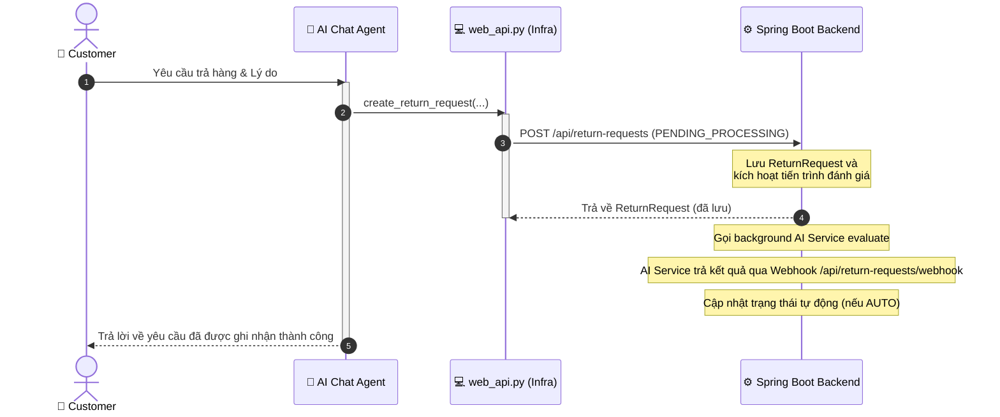
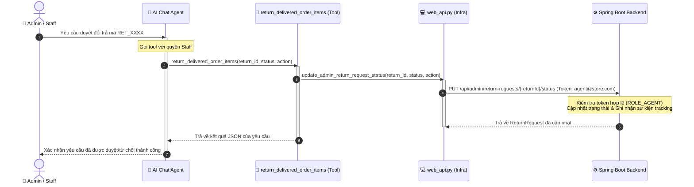

Dưới đây là tài liệu đặc tả chức năng (Product Requirement Document - PRD) hoàn chỉnh cho tính năng Smart Return, bao gồm mô tả nghiệp vụ, kiến trúc hệ thống và biểu đồ tuần tự (Sequence Diagram) bằng mã Mermaid để bạn có thể đưa trực tiếp vào tài liệu thiết kế hệ thống.
------------------------------
## 📋 TÀI LIỆU ĐẶC TẢ TÍNH NĂNG: SMART RETURN (XỬ LÝ ĐỔI TRẢ THÔNG MINH)## 1. MÔ TẢ TÍNH NĂNG (FEATURE DESCRIPTION)
Tính năng Smart Return là giải pháp tự động hóa và bán tự động hóa quy trình tiếp nhận, phân loại, ra quyết định và phản hồi đối với các yêu cầu đổi trả hàng loạt dành cho shop bán lẻ độc lập. Hệ thống kết hợp giữa bộ quy tắc logic cứng (Rule-based) và trí tuệ nhân tạo đọc hiểu ngôn ngữ tự nhiên (NLP AI) nhằm giải phóng sức lao động của nhân viên vận hành, tối ưu chi phí Logistics ngược và nâng cao trải nghiệm khách hàng.
## Các luồng xử lý chính:

* Luồng Tự động (AUTO): Hệ thống tự động phê duyệt (hoàn tiền/đổi hàng) hoặc từ chối dựa trên các điều kiện khớp chính xác tuyệt đối mà không cần con người can thiệp.
* Luồng Bán tự động (SEMI-AUTO): Đối với các ca phức tạp, AI sẽ tự động phân tích dữ liệu, kiểm tra tồn kho và viết một đoạn Tóm tắt đề xuất ngắn gọn (dưới 20 từ) trên màn hình Admin. Nhân viên chỉ cần nhìn bảng tổng hợp hàng loạt và bấm nút duyệt trong 1 cú click.

------------------------------
## 2. KIẾN TRÚC MÔ HÌNH THIẾT KẾ CHÍNH SÁCH (RULE DESIGN)
Hệ thống áp dụng thiết kế theo mô hình Chain of Responsibility (Chuỗi trách nhiệm). Mỗi chính sách (Rule) do Admin cấu hình từ màn hình quản trị sẽ được biên dịch thành một Rule Object độc lập nằm trong danh sách xếp theo thứ tự ưu tiên (Priority):

   1. Rule-Based List (Luật cứng toán học): Kiểm tra các biến số định lượng như: Số ngày nhận hàng, Giá trị sản phẩm, Danh mục cấm (Đồ lót/Đồ bơi), Hạng khách hàng.
   2. NLP Rule List (Luật ngữ nghĩa AI): Chỉ kích hoạt khi luồng luật cứng không khớp. Sử dụng công nghệ NLP/LLM để đọc hiểu các đoạn text mô tả tự do của khách (ví dụ: "bung chỉ", "tuột xích khóa", "giao lộn màu") để đối chiếu với văn bản chính sách gốc của shop.

------------------------------
## 3. BIỂU ĐỒ TUẦN TỰ (SEQUENCE DIAGRAM)
Dưới đây là luồng đi của dữ liệu từ lúc khách hàng gửi yêu cầu trên website cho đến khi AI Backend hoàn tất xử lý ngầm và đồng bộ trạng thái:

sequenceDiagram
    autonumber
    actor Customer as 👤 Customer
    participant Portal as 💻 Web Portal
    participant DB as 🗄️ Database
    participant Job as ⚙️ Background Job
    participant RM as 🧠 AI Rule Manager
    participant RuleObj as 📜 Rule Object (Base)

    %% Giai đoạn 1: Tiếp nhận Đơn hàng
    Customer->>Portal: Submit return request (Portal)
    activate Portal
    Portal->>DB: Save request (Status: PENDING_PROCESSING)
    activate DB
    DB-->>Portal: Confirm save (Ack)
    deactivate DB
    Portal-->>Customer: Return Success response (UI)
    deactivate Portal

    %% Giai đoạn 2: Kích hoạt Tác vụ Ngầm
    Note over Portal, Job: Trigger Asynchronous Process
    Portal->>Job: Enqueue processing job
    activate Job
    Job->>RM: Forward request data
    activate RM

    %% Giai đoạn 3: Lọc và Tìm Quy tắc Phù hợp
    Note over RM, RuleObj: LOOP 1: Scan Priority Rule-Based List (No LLM cost)
    loop Over each Rule-Based Object
        RM->>+RuleObj: check .is_match(request)
        RuleObj-->>-RM: return True / False
        Note over RM: If True -> BREAK LOOP (Stop checking)
    end

    alt No Rule-Based Match Found
        Note over RM, RuleObj: LOOP 2: Scan NLP Rule List (Trigger LangChain/LLM)
        loop Over each NLP Rule Object
            RM->>+RuleObj: check .is_match(request) (NLP Context Mapping)
            RuleObj-->>-RM: return True / False
            Note over RM: If True -> BREAK LOOP (Stop checking)
        end
    end

    %% Giai đoạn 4: Thực thi Hành động & Hoàn tất
    alt Any Rule Matched
        RM->>+RuleObj: execute .handle_action(request)
        RuleObj-->>-RM: return results (AUTO Decision / SEMI Proposal)
        
        alt Mode is AUTO
            RM->>DB: Update status (APPROVED/REJECTED) & Save response msg
            Note over RM, DB: Trigger Auto-Refund / Auto-Shipping API
        else Mode is SEMI-AUTO
            RM->>DB: Update status (PENDING_STAFF) & Save AI Summary
        end
        
    else All Rules Mismatched (No Rule Found)
        RM->>DB: Update status (MANUAL_REVIEW) & Flag for manual check
    end

    RM-->>Job: Job completed successfully
    deactivate RM
    deactivate Job

------------------------------
## 4. MÔ TẢ CHI TIẾT CÁC BƯỚC LOGIC TRONG SƠ ĐỒ## Giai đoạn 1: Gửi và Lưu trữ Yêu cầu (Đồng bộ)

   1. Khách hàng (Customer) điền thông tin đổi trả trên Cổng Portal (chọn món, lý do từ menu, gõ mô tả, đính kèm ảnh) và bấm gửi.
   2. Web Portal tiếp nhận, kiểm tra định dạng và ghi nhận yêu cầu vào Database dưới trạng thái tạm thời là PENDING_PROCESSING.
   3. Hệ thống phản hồi ngay lập tức ra màn hình giao diện báo cho khách hàng biết yêu cầu đã được tiếp nhận thành công. Khách hàng không cần treo máy chờ đợi hệ thống xử lý logic.

## Giai đoạn 2: Chuyển tiếp Bất đồng bộ

   1. Web Portal phát ra một sự kiện (Event) hoặc đẩy một tác vụ vào hàng đợi Background Job (như Celery, BullMQ hoặc RabbitMQ) để xử lý ngầm độc lập.
   2. Background Job lấy gói dữ liệu chi tiết của yêu cầu đổi trả và gọi API chuyển tiếp sang module AI Rule Manager ở lõi xử lý AI Backend.

## Giai đoạn 3: Cơ chế Lọc Quy tắc Tuần tự (The Filtering Loop)

   1. AI Rule Manager kích hoạt vòng lặp đầu tiên, duyệt qua danh sách các quy tắc cứng toán học (Rule-Based List). Cứ qua mỗi thực thể Rule Object, hệ thống gọi hàm .is_match().
   2. Nếu một luật toán học khớp (ví dụ: kiểm tra thấy đơn hàng đã quá 7 ngày), Rule Object trả về True. AI Rule Manager lập tức ngắt vòng lặp (Break Loop) để dừng tiến trình tìm kiếm, tối ưu hiệu năng.
   3. Trong trường hợp đi hết danh sách luật cứng mà không có luật nào khớp (False), AI Rule Manager mới kích hoạt vòng lặp thứ hai, duyệt qua danh sách luật ngôn ngữ tự nhiên (NLP Rule List). Tại đây, hàm .is_match() sẽ gọi mô hình LLM (qua LangChain) để phân tích ngữ nghĩa chuỗi văn bản tự do của khách. Nếu khớp ngữ nghĩa, vòng lặp cũng sẽ lập tức được ngắt.

## Giai đoạn 4: Thực thi Hành động (Execution)

   1. Khi tìm được quy tắc chiến thắng, AI Rule Manager gọi hàm .handle_action() của chính quy tắc đó để sinh ra kết quả xử lý.
   2. Hệ thống cập nhật kết quả vào dữ liệu:
   * Nếu là luồng AUTO (Duyệt/Từ chối thẳng): Cập nhật trạng thái đơn thành APPROVED hoặc REJECTED, tự động chèn nội dung phản hồi cá nhân hóa (đính kèm link chính sách tương ứng) và kích hoạt ngầm các cổng API thanh toán/vận chuyển liên quan.
      * Nếu là luồng SEMI-AUTO: Cập nhật trạng thái đơn thành PENDING_STAFF và lưu chuỗi ai_summary_for_staff (ví dụ: "Đề xuất đổi size XL vì kho tổng còn 5 chiếc, khách mua là khách VIP").
   3. Trường hợp hy hữu nếu đơn hàng đi qua cả 2 vòng lặp mà không khớp bất kỳ một quy tắc nào do Admin thiết lập, hệ thống tự động gắn tag MANUAL_REVIEW để chuyển hoàn toàn cho con người xử lý thủ công bằng mắt từ đầu đến cuối.
   4. Kết thúc tiến trình chạy ngầm, giải phóng tài nguyên hệ thống.

------------------------------
Bản thiết kế prd và cấu trúc sơ đồ sequence tuần tự này đã sẵn sàng để chuyển giao cho Đội ngũ Kiến trúc sư Phần mềm (Software Architect) và Lập trình viên Backend triển khai viết code.

IDea class diagram:
from abc import ABC, abstractmethod

# --- BASE RULE CLASS ---
class Rule(ABC):
    def __init__(self, rule_id, name, condition, action):
        self.rule_id = rule_id
        self.name = name
        self.condition = condition  # Can be a dict or a text description
        self.action = action        # The target outcome (e.g., "REFUND", "REJECT")

    @abstractmethod
    def is_match(self, request: dict) -> bool:
        """Returns True if the request meets the condition, otherwise False."""
        pass

    @abstractmethod
    def run_action(self, request: dict) -> dict:
        """Executes the action and returns the output JSON."""
        pass

# --- CHILD CLASS 1: RULE-BASED (Hard Logic) ---
class RuleBased(Rule):
    def is_match(self, request: dict) -> bool:
        # Simple math/logic check against the condition dict
        for key, expected_value in self.condition.items():
            # Example: check if request['days_since_delivery'] > 7
            if key == "days_since_delivery" and request.get(key, 0) > expected_value:
                return True
            if key == "category" and request.get(key) == expected_value:
                return True
        return False

    def run_action(self, request: dict) -> dict:
        return {
            "request_id": request["request_id"],
            "mode": "AUTO",
            "status": "APPROVED" if self.action != "REJECT" else "REJECTED",
            "action": self.action,
            "message_to_customer": f"System executed: {self.action}"
        }

# --- CHILD CLASS 2: NLP-BASED (AI Logic) ---
class NLPBased(Rule):
    def is_match(self, request: dict) -> bool:
        # Here you call LangChain / LLM to check if text matches the condition description
        user_text = request.get("user_text_description", "")
        policy_text = self.condition # e.g., "Product is torn or ripped"
        
        # Simulating LLM response for simplicity
        if "chat" in user_text or "rach" in user_text: 
            return True
        return False

    def run_action(self, request: dict) -> dict:
        # Generates a summary for staff review
        return {
            "request_id": request["request_id"],
            "mode": "SEMI-AUTO",
            "status": "PENDING_STAFF",
            "action": "WAIT_FOR_APPROVAL",
            "ai_summary_for_staff": f"Propose {self.action} because AI matched description."
        }

Thiết kế Cấu trúc JSON cho condition
{
  "operator": "AND",
  "rules": [
    { "field": "category", "operator": "==", "value": "T-shirt" },
    { "field": "item_value", "operator": "<", "value": 10 },
  ]
}

Test case:
Dưới đây là **3 test case mô tả (không dùng code)**, tập trung đúng vào logic của các class `RuleBased` và `NLPBased`:

---

## ✅ **Test Case 1 – RuleBased.is_match() trả về TRUE khi vượt điều kiện**

* **Mục tiêu:**
  Kiểm tra phương thức `is_match()` của `RuleBased` hoạt động đúng với điều kiện số học.

* **Dữ liệu đầu vào:**

  * Rule:

    * condition: `days_since_delivery > 7`
    * action: REJECT
  * Request:

    * days_since_delivery = 10

* **Bước thực hiện:**

  1. Gọi `is_match(request)`

* **Kết quả mong đợi:**

  * Trả về **TRUE**

* **Giải thích:**
  Giá trị 10 lớn hơn 7 nên thỏa điều kiện rule.

---

## ✅ **Test Case 2 – RuleBased.run_action() trả đúng kết quả AUTO**

* **Mục tiêu:**
  Kiểm tra method `run_action()` trả đúng format và logic status.

* **Dữ liệu đầu vào:**

  * Rule:

    * condition: `category = T-shirt`
    * action: REFUND
  * Request:

    * request_id: R002
    * category: T-shirt

* **Bước thực hiện:**

  1. Gọi `run_action(request)`

* **Kết quả mong đợi:**

  * mode = AUTO
  * status = APPROVED
  * action = REFUND
  * message chứa nội dung thực thi action

* **Giải thích:**
  Theo thiết kế, nếu action khác REJECT → status phải là APPROVED.

---

## ✅ **Test Case 3 – NLPBased xử lý đúng khi text match**

* **Mục tiêu:**
  Kiểm tra cả `is_match()` và `run_action()` của NLP rule.

* **Dữ liệu đầu vào:**

  * Rule:

    * condition: "Product is torn or ripped"
    * action: EXCHANGE
  * Request:

    * user_text_description: "áo bị rách"
    * request_id: R003

* **Bước thực hiện:**

  1. Gọi `is_match(request)`
  2. Nếu TRUE → gọi `run_action(request)`

* **Kết quả mong đợi:**

  * is_match() → TRUE
  * mode = SEMI-AUTO
  * status = PENDING_STAFF
  * action = WAIT_FOR_APPROVAL
  * có `ai_summary_for_staff`

* **Giải thích:**
  Text "rách" được NLP nhận diện là lỗi sản phẩm → match rule → chuyển sang luồng bán tự động.

---

## 🎯 Tổng kết

| Test Case | Class     | Mục tiêu                    |
| --------- | --------- | --------------------------- |
| TC1       | RuleBased | Kiểm tra match logic        |
| TC2       | RuleBased | Kiểm tra output action      |
| TC3       | NLPBased  | Kiểm tra NLP match + output |

---

## 🤖 **Ý tưởng thiết kế cơ chế Agentic AI tự chủ ra quyết định đổi trả**

### 1. Đặt vấn đề & Mục tiêu
Trong mô hình cũ, quá trình ra quyết định đổi trả diễn ra thông qua bộ máy so khớp luật tĩnh (`RuleManager`). Cách tiếp cận này yêu cầu Admin phải thiết lập chi tiết từng luật cứng (`RuleBased`) và luật ngữ nghĩa (`NLPBased`) và gán nhãn hành động duyệt/từ chối tương ứng cho mỗi điều kiện. Đây không phải là một cơ chế tự chủ hoàn toàn của tác tử (Agentic).

Để thể hiện **tính Agentic (tự chủ)** thực sự của AI Agent trong việc tự đưa ra quyết định tuân thủ chính sách:
- Người dùng gửi yêu cầu đổi trả (qua form hoặc chatbot). Yêu cầu này được lưu dưới trạng thái chờ xử lý (`PENDING_PROCESSING`).
- AI Agent sau đó tự động kích hoạt tiến trình đánh giá bằng công cụ `return_delivered_order_items`.
- AI Agent tự động đọc hiểu chính sách đổi trả cốt lõi từ văn bản chính sách (được nạp trong System Prompt).
- AI Agent tự lập luận (reasoning) và đưa ra quyết định tối ưu nhất (duyệt tự động, duyệt bán tự động hay từ chối) dựa trên ngữ cảnh thực tế của đơn hàng mà không cần so khớp tuần tự các luật cứng đã cài sẵn.

### 2. Sơ đồ tuần tự của Luồng Agentic Đổi trả (Sequence Diagrams)

#### Luồng A: Đánh giá tự động qua Webhook (Auto-Evaluation)

#### Luồng B: AI Agent đóng vai trò nhân viên duyệt yêu cầu (Virtual Staff Reviewer)

### 3. Ưu điểm của Cơ chế Agentic
1. **Lập luận linh hoạt**: LLM có thể xử lý các lý do phức tạp, mơ hồ của khách hàng và đưa ra quyết định phù hợp nhất dựa trên tinh thần của chính sách đổi trả thay vì chỉ so khớp từ khóa tĩnh.
2. **Không phụ thuộc luật cứng**: Loại bỏ việc phải liên tục cập nhật và cấu hình các luật phê duyệt/từ chối thủ công cho từng trường hợp nhỏ lẻ.
3. **Phối hợp nhất quán**: Kết hợp đồng bộ giữa việc ghi nhận trạng thái yêu cầu ban đầu (`create_return_request`) và bước duyệt tự chủ của Agent (`return_delivered_order_items`).

---

## 🔑 **Phân Tích Kiến Trúc: Vai Trò (Role) Của AI Agent Trong Hệ Thống Backend**

### 1. Tại sao AI Agent cần một Vai trò (Role) riêng biệt?
Trong một hệ thống bán lẻ thực tế tuân thủ mô hình phân quyền bảo mật (RBAC - Role-Based Access Control), chúng ta không thể cho phép khách hàng tự duyệt yêu cầu đổi trả của chính mình. 
- **Quyền hạn của Khách hàng (Customer Role)**: Chỉ có quyền đọc thông tin đơn hàng cá nhân và gửi yêu cầu đổi trả ở trạng thái chờ duyệt (`PENDING_PROCESSING`).
- **Quyền hạn của AI Agent (AI Agent / Staff Role)**: Cần có quyền truy cập đặc quyền để đánh giá mức độ tuân thủ chính sách, ra quyết định và cập nhật trạng thái đổi trả (`APPROVED` / `REJECTED`) trên cơ sở dữ liệu.

Do đó, AI Agent cần được định danh và phân quyền như một **Nhân viên ảo (Virtual Staff)** trong hệ thống backend.

### 2. Các phương án thiết kế Role cho AI Agent

#### Phương án A: Tài khoản đặc quyền hệ thống (System-to-System Token)
- **Cơ chế**: Khi gọi tool `return_delivered_order_items` để ra quyết định, công cụ không dùng token của khách hàng đang chat. Thay vào đó, nó sử dụng một JWT Token hệ thống (hoặc API Key đặc quyền) được cấu hình riêng cho AI Service để gửi webhook đến Spring Boot.
- **Ưu điểm**: Bảo mật cao, tách biệt hoàn toàn quyền hạn giữa giao diện chat của khách hàng và kênh API nghiệp vụ của hệ thống.
- **Nhược điểm**: Đòi hỏi hệ thống Spring Boot phải cấu hình thêm cơ chế xác thực webhook hệ thống.

#### Phương án B: Tài khoản Nhân viên ảo (Virtual Staff Account - Được áp dụng)
- **Cơ chế**: Tạo một tài khoản nhân viên ảo trong DB Spring Boot (`agent@store.com` với quyền `ROLE_AGENT`). Khi chatbot khởi chạy hoặc khi tool ra quyết định được gọi, hệ thống sẽ đăng nhập tài khoản này để lấy JWT token của nhân viên nhằm xác thực và ghi nhận quyết định.
- **Ưu điểm**: Phù hợp hoàn hảo với đề tài nghiên cứu (Agent đóng vai trò như một nhân viên thật sự đưa ra quyết định), ghi vết hệ thống rõ ràng (`approved_by: "AI_AGENT"`).

### 3. Thiết kế thực thi trong mã nguồn
Để thể hiện tính năng Agentic này:
1. **Trong Spring Boot Backend**: 
   - Đăng ký tài khoản `agent@store.com` qua `DataSeeder.java`.
   - Cập nhật `SecurityConfig.java` cho phép quyền `ROLE_AGENT` truy cập các API quản trị `/api/admin/**`.
2. **Trong Web API (agentic_ai)**: Cấu hình `update_admin_return_request_status` đăng nhập và sử dụng token của `agent@store.com`.
3. **Trong Tools**: Công cụ `return_delivered_order_items` gọi API quản trị PUT để thực thi việc duyệt/từ chối trạng thái yêu cầu đổi trả dưới vai trò là Agent.

